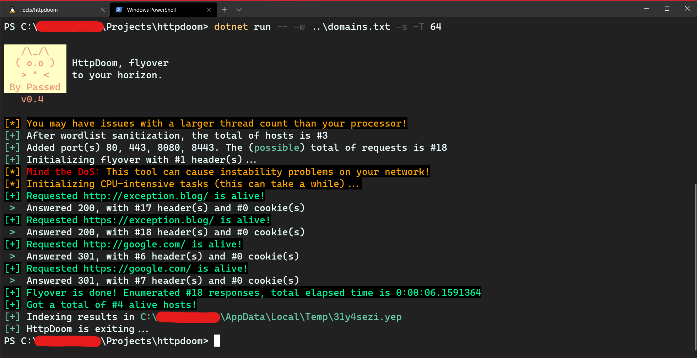

<p align="center">
<a href="https://github.com/BizarreNULL/httpdoom/">
  
</a>
</p>
<h1 align="center">
  HttpDoom - <b>Flyover the horizon</b>
</h1>

<p align="center">
  Validate large HTTP-based attack surfaces in a very fast way. Heavily inspired by <a href="https://github.com/michenriksen/aquatone">Aquatone</a>.
  <br/><br/>
  <a href="http://www.wtfpl.net/txt/copying/">
    
  </a>
  
</p>


## Why?

When I utilize Aquatone to flyover some hosts, I have some performance issues by the screenshot feature, and the lack of extension capabilities - like validating front-end technologies with a plugin-like system -, also, my codebase is mainly C# and Rust, and make the maintenance of a tool wrote in another language can lead to a lot of issues.

With these ideas in mind, HttpDoom is born.


## Installing

In order to install HttpDoom, in the current release cycle, due to not have a runtime-independent build at this time (**only *devel* builds are available**), you **must have .NET5 runtime (or SDK) - AKA `dotnet` - installed in your host**, with the .NET toolchain available in your Linux or macOS (automatic installation for Windows is not supported at this time, your PR to installation script is welcome. WSL works fine):

```sh
$ mkdir $HOME/Tools
$ echo "PATH=$HOME/Tools:$PATH" >> .zshrc # or what is your current shell profile
```

And at least, executing the script `./installer.sh` in the base directory of this *repo* (you can download in releases, or `git clone`).


## How this works?

The description (`--help`) of the CLI is all you need to know:


Also, HttpDoom have a _nice_ output:




## But it is fast?

Let's take a look on the result of a flyover agains 5000 hosts on default HttpDoom ports (80, 443, 8080 and 8433) with 2 threads (provided by a generic Amazon EC2 instance) agains the same settings on Aquatone 1.7.0:

HttpDoom:

```
...
[+] Flyover is done! Enumerated #31128 responses in 2.49 minute(s)
[+] Got a total of #176 alive hosts!
...
```

Aquatone:

```
...
Writing session file...Time:
 - Started at  : 2020-12-20T08:27:43Z
 - Finished at : 2020-12-20T08:34:35Z
 - Duration    : 6m52s
...
```

> **Note**: The results of these tests can vary a lot based on a series of specific conditions of your host. Make the test locally and check which tool offers the best performance.


## Output

By default, we create all the necessary directories, and we also randomly choose their names (you can set this up with `-o`, in doubt see `--help`).

Within the main directory, a `general.json` file is created containing all the results in a single file (to facilitate the search or ingestion in some visual tool), which looks like this:

```json
[
    {
        "Domain": "google.com",
        "Addresses": [
            "2800:3f0:4001:80f::200e",
            "172.217.173.110"
        ],
        "Requested": "http://google.com/",
        "Port": 80,
        "Content": "\u003CHTML\u003E\u003CHEAD\u003E\u003Cmeta http-equiv=\u0022content-type\u0022 content=\u0022text/html;charset=utf-8\u0022\u003E\n\u003CTITLE\u003E301 Moved\u003C/TITLE\u003E\u003C/HEAD\u003E\u003CBODY\u003E\n\u003CH1\u003E301 Moved\u003C/H1\u003E\nThe document has moved\n\u003CA HREF=\u0022http://www.google.com/\u0022\u003Ehere\u003C/A\u003E.\r\n\u003C/BODY\u003E\u003C/HTML\u003E\r\n",
        "ScreenshotPath": "C:\\Users\\REDACTED\\AppData\\Local\\Temp\\31y4sezi.yep\\Screenshots\\c1d50408-bf98-47b8-9787-d348bf17a1c8.png",
        "Headers": [
            {
                "Key": "Location",
                "Value": [
                    "http://www.google.com/"
                ]
            },
            {
                "Key": "Date",
                "Value": [
                    "Wed, 23 Dec 2020 12:44:51 GMT"
                ]
            },
            {
                "Key": "Cache-Control",
                "Value": [
                    "public, max-age=2592000"
                ]
            },
            {
                "Key": "Server",
                "Value": [
                    "gws"
                ]
            },
            {
                "Key": "X-XSS-Protection",
                "Value": [
                    "0"
                ]
            },
            {
                "Key": "X-Frame-Options",
                "Value": [
                    "SAMEORIGIN"
                ]
            }
        ],
        "Cookies": [],
        "StatusCode": 301
    }
]
```

A directory called *Individual Results* is also created, indexing the results individually, categorically based on the name of the URI (and port, if is different from 80 or 443) used for the request, as well the screenshots, if you use HttpDoom with option `-s`:

```
.
├── general.json
├── Individual Results
│   ├── exception.blog.json
│   └── google.com.json
└── Screenshots
    ├── 658cf47d-0a10-4302-91a0-e5900201dced.png
    ├── 7ee17334-4936-46f9-b156-f0aa53ce749a.png
    ├── c1d50408-bf98-47b8-9787-d348bf17a1c8.png
    └── df37f112-f20d-488b-9153-aa2593654af6.png
```


## Roadmap

The project are focused to be a really useful tool.

- [x] **0x00**: Make the satuday project work;
- [x] **0x01**: Baking the CLI options very similar to Aquatone;
- [x] **0x02**: Fix issues with large (5K+) hosts wordlists;
- [x] **0x03**: Well, this is not "threads" but work like, maybe need a better polishing;
- [x] **0x04** Screenshots because why not;
- [ ] **0x05**: Create the community-driven fingerprint engine to enumerate vulnerabilities on headers and bodies of the HTTP responses;


## Licenses

[HttpDoom](https://github.com/BizarreNULL/httpdoom) project icons made by [Freepik](www.flaticon.com/authors/freepik) from [Flaticon](https://www.flaticon.com/). The source code is licensed under [WTFPL](http://www.wtfpl.net/).